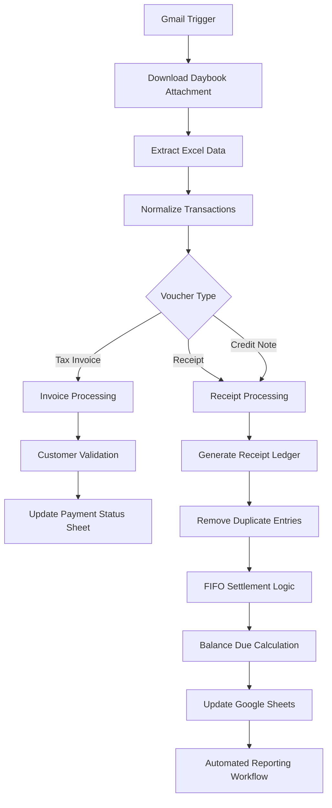

# Automated Finance Reconciliation & Reporting System

## Overview
Built an end-to-end finance automation system using Gmail, Tally Daybook exports, Google Sheets, and n8n to automate accounting operations, payment reconciliation, and reporting workflows.

The system automatically fetches Daybook reports from Gmail, extracts transaction data, updates receipt ledgers, performs FIFO-based payment settlement, and maintains accurate balance tracking with minimal manual intervention.

---

## Tech Stack

- n8n Workflow Automation
- Gmail API
- Google Sheets API
- JavaScript
- Excel Processing
- FIFO Reconciliation Logic
- Tally Daybook Reports

---

## System Workflow



---

# Core Features

## 1. Automated Gmail Data Ingestion
- Monitors Gmail labels continuously
- Downloads Tally Daybook attachments automatically
- Processes Excel files without manual uploads

---

## 2. Excel Parsing & Data Normalization
- Extracts invoice and receipt entries
- Converts Excel date formats
- Cleans raw accounting data
- Standardizes transaction structures

---

## 3. Voucher Segregation Logic
Automatically categorizes:
- Tax Invoices
- Receipts
- Credit Notes

---

## 4. Customer Validation Engine
- Matches party names against approved customer roster
- Excludes unwanted or invalid parties
- Prevents incorrect ledger entries

---

## 5. Receipt Ledger Automation
- Creates unique receipt keys
- Detects duplicate receipts
- Prevents duplicate accounting entries

---

## 6. FIFO Payment Settlement Engine
Implements automatic FIFO reconciliation logic:
- Oldest invoices settled first
- Partial payments supported
- Remaining balances tracked automatically

---

## 7. Automated Balance Tracking
- Updates outstanding balances
- Maintains payment history
- Tracks full and partial settlements

---

## 8. Google Sheets Synchronization
Automatically updates:
- Payment Status Sheet
- Receipt Ledger
- Outstanding Balances
- Processed Transactions

---

## 9. Approval Workflow Automation
- Sends approval emails automatically
- Supports manual finance verification
- Enables controlled ledger updates

---

# Business Impact

## Operational Improvements
- Reduced manual reconciliation work
- Eliminated duplicate payment entries
- Improved financial tracking accuracy
- Automated daybook processing
- Faster accounts receivable management

---

# Key Automation Logic

## Duplicate Prevention

```javascript
const existingKeys = new Set(
  ledgerItems.map(i => String(i.json.receipt_key || "").trim())
);

if (existingKeys.has(key)) {
  continue;
}
```

---

## FIFO Settlement Logic

```javascript
let settle = Math.min(remaining, bill.balance_due);

bill.balance_due = newBalance;
remaining -= settle;
```

---

# Folder Structure

```txt
finance-automation-system/
│
├── workflows/
│   ├── daybook-entry-automation.json
│   ├── receipt-ledger-automation.json
│   └── reporting-workflow.json
│
├── docs/
│   ├── architecture.png
│   ├── workflow-diagram.png
│   └── README.md
│
└── samples/
    └── sample-daybook.xlsx
```

---

# Resume Description

Developed an automated finance reconciliation system using n8n, Gmail API, Google Sheets, and JavaScript to process Tally Daybook exports, automate receipt settlement, maintain ledger accuracy, and generate reporting workflows with duplicate prevention and FIFO reconciliation logic.

---

# Future Enhancements

- Power BI Dashboard Integration
- Automated WhatsApp Payment Alerts
- AI-based Anomaly Detection
- ERP Integration
- Real-time Finance Analytics
- Multi-company Ledger Support

---

# Conclusion

This project demonstrates a complete production-grade finance automation workflow that integrates accounting data extraction, reconciliation, ledger automation, and reporting into a single scalable system.
